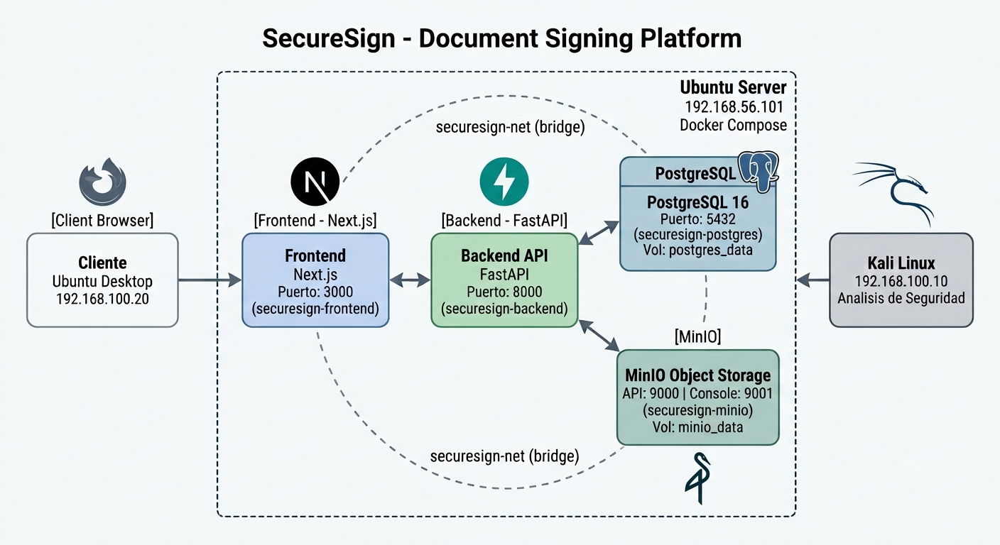
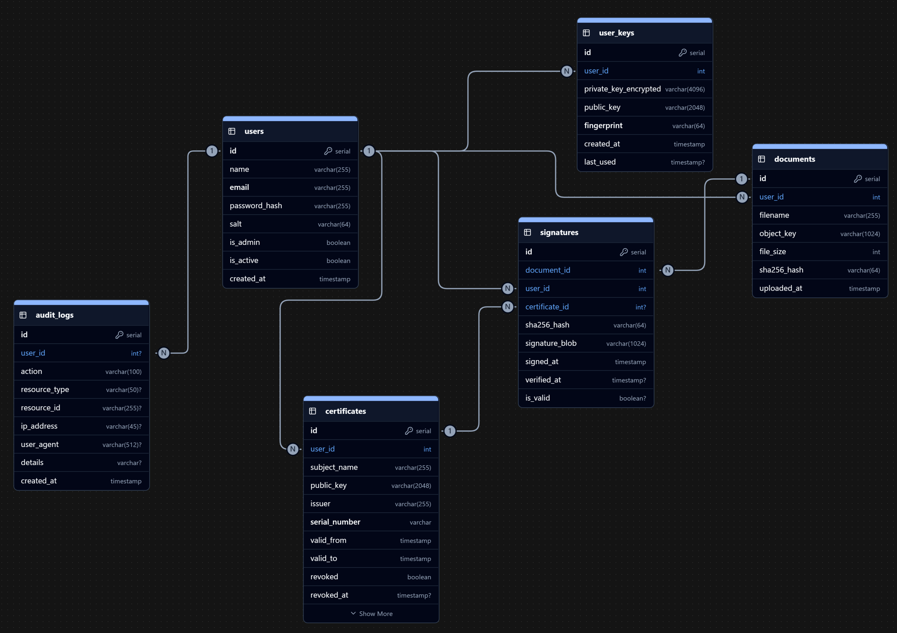
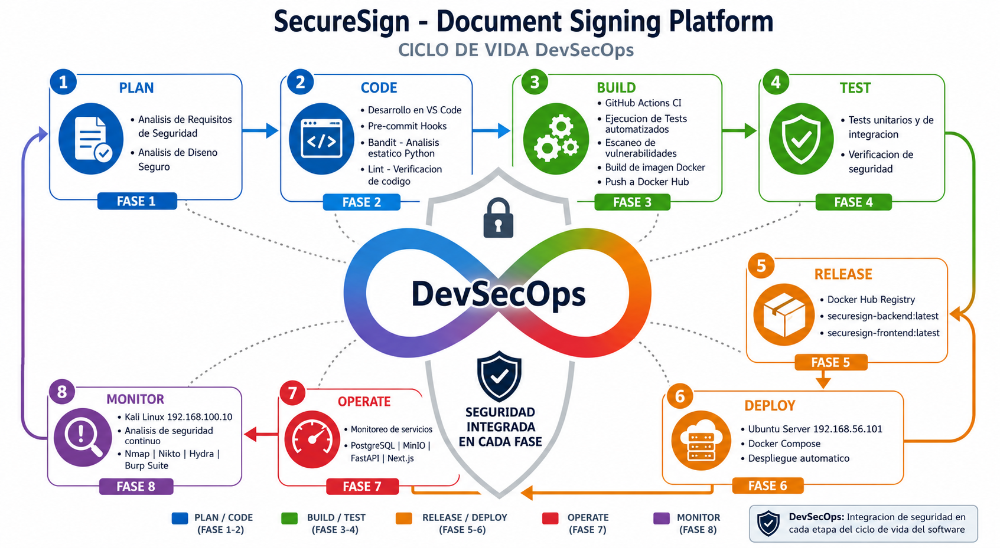

# SecureSign - Plataforma de Firma Digital y Validacion Criptografica

[](https://www.python.org/)
[](https://fastapi.tiangolo.com/)
[](https://nextjs.org/)
[](https://www.docker.com/)
[](https://opensource.org/licenses/MIT)

> Plataforma web para firma digital de documentos con validacion criptografica RSA, gestion de certificados digitales y trazabilidad completa de auditoria. Desarrollada como proyecto academico de la materia Ingenieria de la Seguridad de Software - 30808, ESPE.


---

## Tabla de Contenidos

- [Descripcion del Proyecto](#descripcion-del-proyecto)
- [Arquitectura del Sistema](#arquitectura-del-sistema)
- [Tecnologias Utilizadas](#tecnologias-utilizadas)
- [Pre-requisitos](#pre-requisitos)
- [Instalacion Local](#instalacion-local)
- [Despliegue con Docker](#despliegue-con-docker)
- [Cuenta de Administrador](#cuenta-de-administrador)
- [Pipeline DevSecOps](#pipeline-devsecops)
- [Estructura del Proyecto](#estructura-del-proyecto)
- [Funcionalidades](#funcionalidades)
- [Seguridad](#seguridad)
- [Licencia](#licencia)

---

## Descripcion del Proyecto

**SecureSign** es una plataforma web completa para la firma digital de documentos que implementa:

- **Firma digital RSA**: Generacion de pares de llaves criptograficas (publica/privada) para cada usuario
- **Firma de documentos PDF**: Upload de documentos, calculo de hash SHA-256 y firma digital automatica
- **Verificacion de firmas**: Validacion criptografica de integridad y autenticidad de documentos firmados
- **Gestion de certificados**: CA simulada para emision y renovacion de certificados digitales X.509
- **Almacenamiento seguro**: Documentos originales y firmados almacenados en MinIO (object storage)
- **Trazabilidad completa**: Registro de auditoria de todas las acciones realizadas en la plataforma
- **Panel de administracion**: Gestion de usuarios, visualizacion de logs y metricas del sistema

La plataforma esta disenada con principios de **diseno seguro** y sigue un pipeline **DevSecOps** con analisis de seguridad integrado en cada fase del ciclo de vida del software.

---

## Arquitectura del Sistema

La plataforma utiliza una arquitectura de microservicios containerizada con Docker Compose:



### Servicios

| Servicio | Tecnologia | Puerto | Descripcion |
|----------|------------|--------|-------------|
| **Frontend** | Next.js 16 + React 19 | 3000 | Interfaz de usuario SPA con Tailwind CSS |
| **Backend API** | FastAPI + Python 3.11 | 8000 | API REST con autenticacion JWT |
| **Base de datos** | PostgreSQL 16 | 5432 | Almacenamiento relacional de usuarios, documentos y auditoria |
| **Object Storage** | MinIO | 9000/9001 | Almacenamiento de documentos PDF originales y firmados |

### Diagrama de Base de Datos



---

## Tecnologias Utilizadas

### Frontend
- **Next.js 16** - Framework React para aplicaciones full-stack
- **React 19** - Libreria de interfaces de usuario
- **TypeScript** - Tipado estatico para JavaScript
- **Tailwind CSS 4** - Framework de estilos utility-first
- **Zod** - Validacion de esquemas declarativa

### Backend
- **FastAPI** - Framework web asincrono de alto rendimiento
- **SQLModel** - ORM basado en SQLAlchemy y Pydantic
- **PostgreSQL** - Base de datos relacional robusta
- **MinIO** - Object storage compatible con S3
- **python-jose** - Implementacion de JWT y criptografia
- **cryptography** - Libreria de seguridad criptografica
- **bcrypt** - Hashing de contraseñas seguro

### DevOps y Seguridad
- **Docker + Docker Compose** - Containerizacion y orquestacion
- **GitHub Actions** - CI/CD automatizado
- **Bandit** - Analisis estatico de seguridad en Python
- **ESLint** - Analisis de calidad de codigo frontend
- **Trivy** - Escaneo de vulnerabilidades en imagenes Docker
- **Pre-commit hooks** - Validaciones antes de cada commit

---

## Pre-requisitos

Antes de ejecutar la plataforma localmente, asegurate de tener instalado:

| Herramienta | Version minima | Enlace de instalacion |
|-------------|----------------|----------------------|
| **Git** | 2.0+ | [git-scm.com](https://git-scm.com/) |
| **Node.js** | 20+ | [nodejs.org](https://nodejs.org/) |
| **Python** | 3.11+ | [python.org](https://www.python.org/) |
| **Docker** | 24+ | [docker.com](https://www.docker.com/) |
| **Docker Compose** | v2+ | [docs.docker.com/compose](https://docs.docker.com/compose/) |

---

## Instalacion Local

### 1. Clonar el repositorio

```bash
git clone https://github.com/AlexDaniel593/securesign-platform.git
cd securesign-platform
```

### 2. Configurar variables de entorno

```bash
cp .env.example .env
```

Edita el archivo `.env` con tus propios valores de seguridad:

```bash
# Generar SECRET_KEY (64 bytes en hex)
openssl rand -hex 64

# Generar AES_KEY (32 bytes en hex)
openssl rand -hex 32

# Generar contraseñas seguras para PostgreSQL
openssl rand -base64 24
```

### 3. Ejecutar con Docker (Recomendado)

```bash
# Construir e iniciar todos los servicios
docker compose up -d --build

# Verificar que los servicios estan ejecutandose
docker compose ps

# Ver logs en tiempo real
docker compose logs -f
```

La plataforma estara disponible en:
- **Frontend**: http://localhost:3000
- **Backend API**: http://localhost:8000
- **API Docs (Swagger)**: http://localhost:8000/docs
- **MinIO Console**: http://localhost:9001

### 4. Ejecutar localmente (Desarrollo)

**Backend:**
```bash
cd backend

# Crear entorno virtual
python -m venv .venv

# Activar entorno virtual
# Linux/Mac:
source .venv/bin/activate
# Windows:
.venv\Scripts\activate

# Instalar dependencias
pip install -r requirements.txt

# Ejecutar el servidor
uvicorn main:app --reload --host 0.0.0.0 --port 8000
```

**Frontend** (en otra terminal):
```bash
cd frontend

# Instalar dependencias
npm install

# Ejecutar en modo desarrollo
npm run dev
```

---

## Despliegue con Docker

### Despliegue en Ubuntu Server

```bash
# 1. Clonar el repositorio en el servidor
git clone https://github.com/AlexDaniel593/securesign-platform.git
cd securesign-platform

# 2. Configurar variables de entorno
cp .env.example .env
nano .env  # Editar con valores de produccion

# 3. Construir y ejecutar
docker compose up -d --build

# 4. Verificar servicios
docker compose ps
docker compose logs backend
```

### Comandos utiles de Docker

```bash
# Ver logs de un servicio especifico
docker compose logs -f backend
docker compose logs -f frontend

# Reiniciar un servicio
docker compose restart backend

# Detener todos los servicios
docker compose down

# Limpiar imagenes y volumentes
docker compose down -v --rmi all
```

---

## Cuenta de Administrador

La cuenta de administrador se crea automaticamente al iniciar la plataforma:

| Campo | Valor |
|-------|-------|
| **Email** | admin@admin.com |
| **Password** | Admin123! |
| **Nombre** | Administrador |

> **Nota**: Estas son las credenciales por defecto. En produccion, cambia estas valores en el archivo `.env` antes del despliegue.

---

## Pipeline DevSecOps

SecureSign implementa un pipeline DevSecOps completo que integra seguridad en cada fase del ciclo de vida del desarrollo de software.



### Fase 1: Seguridad en Desarrollo (Pre-commit)

Herramientas que se ejecutan automaticamente antes de cada commit:

| Herramienta | Que escanea | Comando |
|-------------|-------------|---------|
| **Bandit** | Codigo Python en busca de vulnerabilidades de seguridad | `bandit -r backend/app/ -ll` |
| **ESLint** | Codigo frontend para calidad y errores comunes | `npm run lint` |

Configuracion en `.pre-commit-config.yaml`:
```yaml
repos:
  - repo: https://github.com/PyCQA/bandit
    rev: 1.7.7
    hooks:
      - id: bandit
        args: ["-ll", "-r", "backend/app/"]
  - repo: local
    hooks:
      - id: eslint
        entry: npm --prefix frontend run lint
        language: system
```

### Fase 2: Integracion Continua (CI - GitHub Actions)

Se ejecuta automaticamente en cada push y pull request:

| Paso | Herramienta | Descripcion |
|------|-------------|-------------|
| Checkout | actions/checkout | Clona el repositorio |
| Lint Frontend | ESLint | Verifica calidad de codigo TypeScript |
| Lint Backend | Bandit | Analisis estatico de seguridad Python |
| Tipo Frontend | TypeScript (tsc) | Verificacion de tipos |
| Pruebas | pytest + Jest | Ejecucion de pruebas unitarias |
| Escaneo Docker | Trivy | Escaneo de vulnerabilidades en imagenes |
| Escaneo Dependencias | OWASP Dependency Check | Verificacion de librerias vulnerables |

### Fase 3: Despliegue Continuo (CD)

Se ejecuta al hacer merge a la rama `main`:

| Paso | Descripcion |
|------|-------------|
| Build Docker | Construye imagenes del backend y frontend |
| Escaneo Final | Verificacion de seguridad con Trivy |
| Push a Docker Hub | Sube imagenes al registry |
| Deploy Ubuntu Server | `docker compose pull && docker compose up -d` |
| Health Check | Verificacion de que el servicio responde correctamente |

### Analisis de Requisitos de Seguridad

El proyecto implementa los siguientes controles de seguridad:

- **Autenticacion JWT**: Tokens de acceso con expiracion configurable
- **Hashing de contraseñas**: bcrypt con salt para almacenamiento seguro
- **Cifrado AES-256**: Para datos sensibles en reposo
- **Firma RSA**: Para documentos digitales con no-repudio
- **CORS configurado**: Restriccion de origenes permitidos
- **Headers de seguridad**: X-Content-Type-Options, X-Frame-Options
- **Rate limiting**: Proteccion contra fuerza bruta (pendiente)
- **Audit logging**: Trazabilidad completa de acciones

### Analisis de Diseno Seguro

- **Principio de menor privilegio**: Cada servicio solo accede a los recursos necesarios
- **Separacion de responsabilidades**: Frontend, Backend y Base de datos desacoplados
- **Validacion de entrada**: Pydantic para validacion estricta en la API
- **Manejo seguro de secretos**: Variables de entorno, nunca en codigo fuente
- **Almacenamiento seguro**: Private keys nunca salen del servidor
- **Docker aislado**: Cada servicio en su propio contenedor con red bridge

---

## Estructura del Proyecto

```
securesign-platform/
├── .github/
│   └── workflows/
│       └── devsecops.yml          # Pipeline DevSecOps
├── .pre-commit-config.yaml        # Hooks de pre-commit
├── docker-compose.yml             # Orquestacion de servicios
├── .env.example                   # Variables de entorno ejemplo
├── backend/
│   ├── Dockerfile                 # Imagen Docker del backend
│   ├── requirements.txt           # Dependencias Python
│   ├── main.py                    # Punto de entrada FastAPI
│   ├── app/
│   │   ├── api/v1/                # Endpoints de la API
│   │   ├── core/                  # Configuracion y seguridad
│   │   ├── db/                    # Base de datos y migraciones
│   │   ├── models/                # Modelos de datos
│   │   └── services/              # Logica de negocio
│   └── tests/                     # Pruebas unitarias
├── frontend/
│   ├── Dockerfile                 # Imagen Docker del frontend
│   ├── package.json               # Dependencias Node.js
│   ├── app/                       # Paginas Next.js
│   ├── features/                  # Modulos funcionales
│   │   ├── auth/                  # Autenticacion
│   │   ├── documents/             # Gestion de documentos
│   │   ├── certificates/          # Certificados digitales
│   │   ├── audit/                 # Logs de auditoria
│   │   └── admin/                 # Panel de administracion
│   └── lib/                       # Utilidades compartidas
└── docs/
    ├── analisis-seguridad.md      # Informe de analisis de seguridad
    └── img/                       # Imagenes y diagramas
```

---

## Funcionalidades

### Gestión de Documentos
- Upload de documentos PDF
- Firma digital automatica con RSA
- Descarga de documentos firmados (sufijo `-signed`)
- Verificacion de integridad por hash SHA-256

### Autenticacion y Autorizacion
- Registro de usuarios con validacion de contraseñas fuertes
- Login con JWT tokens
- Sesiones seguras con cookies HttpOnly
- Roles de usuario (Admin/Usuario)

### Certificados Digitales
- CA simulada para emision de certificados
- Generacion de pares de llaves RSA
- Renovacion y revocacion de certificados
- Visualizacion de detalles del certificado

### Panel de Administracion
- Gestion de usuarios (crear, listar, eliminar)
- Metricas del sistema en tiempo real
- Logs de auditoria completos
- Estadisticas de documentos y firmas

### Auditoria
- Registro automatico de acciones
- Filtros por usuario, accion y fecha
- Exportacion de logs
- Dashboard con metricas

---

## Seguridad

Para informacion detallada del analisis de seguridad realizado con Kali Linux, consulta el [Informe de Analisis de Seguridad](docs/analisis-seguridad.md).

### Controles Implementados

| Control | Estado | Descripcion |
|---------|--------|-------------|
| Autenticacion JWT | Implementado | Tokens con expiracion configurable |
| Hashing de contraseñas | Implementado | bcrypt con salt automatico |
| Cifrado AES-256 | Implementado | Para datos sensibles en reposo |
| Firma RSA | Implementado | Documentos digitales con no-repudio |
| CORS | Implementado | Origenes restringidos |
| Headers de seguridad | Implementado | X-Content-Type-Options, X-Frame-Options |
| SQL Injection | Resistente | ORM con consultas parametrizadas |
| Archivos sensibles | Protegidos | No expuestos via HTTP |

---

## Licencia

Este proyecto esta bajo la licencia MIT. Consulta el archivo [LICENSE](LICENSE) para mas detalles.

---

## Autores

- **Alex Daniel** 
- **Kevin Amaguana**
- **Josue Guallichico**

## Agradecimientos

- Universidad de las Fuerzas Armadas - ESPE
- Materia: Ingenieria de la Seguridad de Software - 30808
- Docente: Ing. Walter Fuertes Ph,D.
